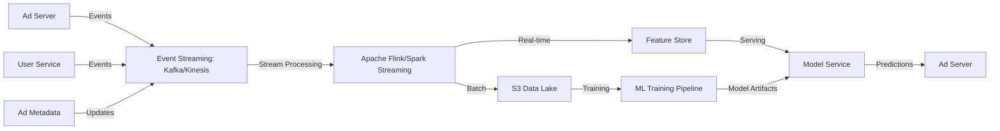
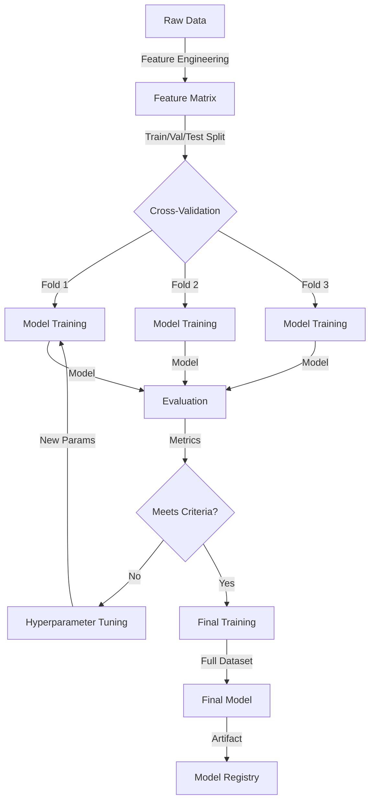
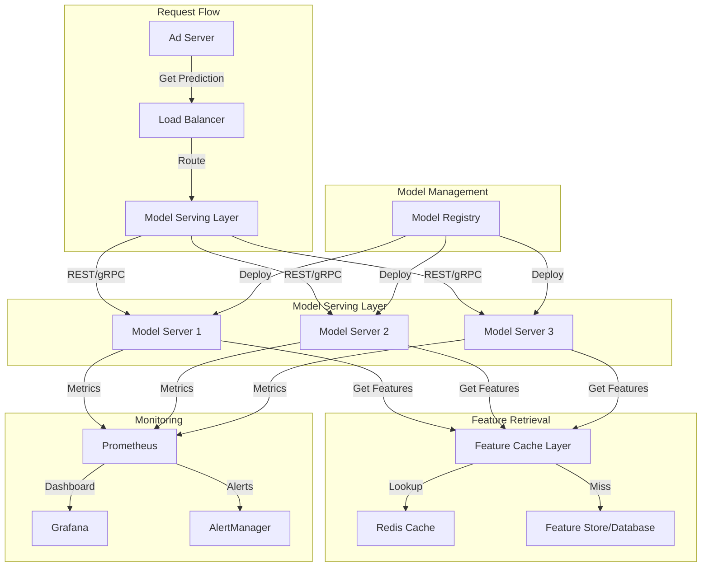
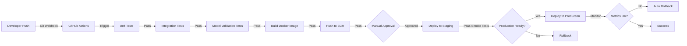

# End-to-End MLOps for Ad Click-Through Rate Prediction
## Comprehensive Production Implementation Guide

---

## TABLE OF CONTENTS
1. [Business Requirements & Problem Definition](#business-requirements)
2. [Data Strategy & Pipeline](#data-strategy)
3. [Feature Engineering & Data Processing](#feature-engineering)
4. [Model Development & Training](#model-development)
5. [Model Validation & Evaluation](#model-validation)
6. [Deployment Architecture](#deployment-architecture)
7. [CI/CD Pipeline](#cicd-pipeline)
8. [Monitoring & Observability](#monitoring)
9. [Infrastructure as Code](#infrastructure)
10. [Operations & Maintenance](#operations)

---

## BUSINESS REQUIREMENTS {#business-requirements}

### 1.1 Problem Statement
**Objective**: Predict the probability that a user will click on an ad based on user, ad, and contextual features.

**Business Goals**:
- **Revenue Optimization**: Maximize CTR to increase ad conversions and platform revenue
- **User Experience**: Show relevant ads to improve engagement and reduce ad fatigue
- **Cost Efficiency**: Reduce wasted impressions by filtering low-CTR placements
- **Real-time Decision Making**: Provide predictions within 100-200ms for live bidding

### 1.2 Key Stakeholders
| Stakeholder | Requirements |
|-----------|--------------|
| Product Team | Real-time predictions, A/B testing support |
| Data Science | Model performance metrics, feature importance |
| Engineering | Low latency (<200ms), high availability (99.9%) |
| Finance | Revenue impact tracking, cost per prediction |
| Compliance | Model explainability, fairness audits |

### 1.3 Success Metrics
- **Technical**: AUC > 0.85, Precision > 0.75, F1 Score > 0.70
- **Business**: 15-20% increase in CTR, 10% revenue lift
- **Operational**: 99.95% uptime, <100ms p99 latency, <$0.001 per prediction

### 1.4 Constraints & Assumptions
- **Latency SLA**: <200ms end-to-end (including feature lookup)
- **Data Volume**: 10-100M events/day
- **Model Size**: <500MB for edge deployment
- **Cold Start**: Handle new users/ads with fallback strategy
- **Data Retention**: 90-day rolling window for training data

---

## DATA STRATEGY & PIPELINE {#data-strategy}

### 2.1 Data Sources

#### Primary Sources
```
User Events (Click Stream):
├── User ID, Session ID
├── Ad ID, Campaign ID, Publisher ID
├── Timestamp, Device Type, OS, Browser
├── IP Address, Location (Country/City)
├── Referrer, Page Category
└── Impression/Click/Conversion Labels

Ad Metadata:
├── Ad Content (Title, Description, Image)
├── Ad Category, Subcategory
├── Advertiser ID, Bid Amount
├── Creative Quality Score
└── Ad Age & Performance History

User Profile:
├── User Segment, Demographics
├── Historical CTR, Engagement Score
├── Interests, Browsing History
├── LTV (Lifetime Value)
└── Privacy Flags (GDPR, CCPA)

Context Data:
├── Time of Day, Day of Week, Season
├── Current Trending Topics
├── Inventory Supply
├── Competitive Bidding Data
└── System Load Metrics
```

#### Data Storage Architecture
```
Raw Data Layer (Data Lake - S3):
  ├── daily_events_partition/year=2024/month=06/day=07/
  ├── ad_metadata/incremental/
  ├── user_profiles/snapshot/
  └── context_data/real-time/

Processed Data Layer (Data Warehouse - Redshift/Snowflake):
  ├── events_processed (deduplicated, validated)
  ├── features_materialized (pre-computed features)
  └── labels_balanced (training dataset)

Feature Store (Feast/Tecton):
  ├── user_features (age, interests, historical_ctr)
  ├── ad_features (category, content_quality, bid_amount)
  └── interaction_features (user_ad_embedding, similarity_score)
```

### 2.2 Data Collection Architecture



### 2.3 Data Pipeline Architecture

**Stage 1: Ingestion**
```python
# Events arrive through streaming infrastructure
- Kafka/Kinesis: 100k events/second
- Schema validation: Avro/Protobuf
- Dead letter queue for malformed events
- Idempotency keys for deduplication
```

**Stage 2: Transformation**
```python
# Real-time processing
- Event deduplication (last 24 hours)
- Data validation & anomaly detection
- PII anonymization (IP hashing, user ID tokenization)
- Feature extraction from raw events
```

**Stage 3: Storage**
```python
# Multi-tier storage strategy
- Hot: Redis cache (1-hour features)
- Warm: Feature Store (daily features)
- Cold: S3/Data Warehouse (historical data)
```

### 2.4 Data Quality & Validation

```
Data Quality Checks:
├── Schema Validation
│   └── Verify all required fields present
├── Statistical Checks
│   ├── Null/Missing Value Rate < 0.5%
│   ├── Outlier Detection (IQR method)
│   └── Distribution Shift Detection (KS Test)
├── Business Logic Checks
│   ├── CTR must be [0, 1]
│   ├── Timestamp must be recent (<24h)
│   └── Campaign ID must exist in metadata
├── Referential Integrity
│   ├── User ID exists in user profiles
│   ├── Ad ID exists in ad metadata
│   └── No orphaned records
└── Freshness Checks
    └── Max data age < 2 hours
```

**Monitoring & Alerting**:
- Data quality score dashboard (>95% required)
- Alert on: >1% nulls, >5% schema violations, >10% statistical anomalies
- Automated data recovery: retry, fallback to cached features

---

## FEATURE ENGINEERING & DATA PROCESSING {#feature-engineering}

### 3.1 Feature Categories

#### User Features (Behavioral)
```
User ID Embedding:
  - User2Vec embedding (128-dim, trained on historical click patterns)
  - Historical CTR (overall, by category, by advertiser)
  - Engagement score (clicks per session)
  - Session frequency & recency
  - Total impressions seen
  - Click-to-impression ratio by device type

User Demographics:
  - Age group (if available)
  - Gender (if available)
  - Geographic location (country, city, DMA)
  - Device type (mobile, desktop, tablet)
  - OS & Browser
  - Network type (WiFi, 4G, 5G)

User Preferences:
  - Interest categories (Top-5 clicked categories)
  - Content preferences (news, entertainment, e-commerce)
  - Brand affinity (preferred advertisers)
  - Price sensitivity
```

#### Ad Features (Content & Campaign)
```
Ad Content Features:
  - Ad ID & Creative ID
  - Ad category & subcategory
  - Content embeddings (BERT/transformers on title+description)
  - Image features (CNN features: colors, composition, objects)
  - Ad copy length
  - Urgency indicators (Sale, Limited Time)
  - CTA presence & type

Campaign Features:
  - Advertiser ID & quality score
  - Campaign age (days live)
  - Campaign budget & spend rate
  - Historical advertiser CTR
  - Bid amount (normalized)
  - Campaign type (brand, performance, dynamic)
  - Creative rotation strategy
```

#### Contextual Features (Time & Environment)
```
Temporal Features:
  - Hour of day (24 categorical)
  - Day of week (7 categorical)
  - Day of month (cyclical: sin/cos encoding)
  - Month (cyclical)
  - Is_weekend, Is_holiday
  - Time since last ad view (user)
  - Days since campaign start

Environmental Features:
  - Page category
  - Page quality score
  - Inventory supply (total ads available)
  - Current page CTR (cross-sectional)
  - Weather (if relevant to ad category)
  - Trending topics (NLP topic modeling)
  - Supply/demand ratio
```

#### Interaction Features (User-Ad Relationship)
```
Similarity Features:
  - Cosine similarity (user interests vs ad category)
  - Embedding distance (user2vec vs ad2vec)
  - Category match score

Historical Features:
  - User-advertiser interaction count
  - User-category interaction count
  - Average CTR for this user-category pair
  - Time since user last clicked advertiser's ad
  - User's CTR on this ad size/placement type

Contextual Match:
  - Ad relevance score (user features vs page context)
  - Brand-page fit score
  - Content alignment (user interests vs page topic)
```

### 3.2 Feature Engineering Pipeline

```python
# Pseudocode for feature engineering workflow

BATCH_FEATURES (computed daily):
├── Historical Statistics
│   ├── Aggregate user behavior (7, 30, 90 day windows)
│   ├── Aggregate ad performance
│   └── Cache in Feature Store
├── Embeddings
│   ├── User2Vec (Word2Vec on click sequences)
│   ├── Ad2Vec (embeddings from ad content)
│   ├── Content embeddings (BERT for text)
│   └── Retrain weekly on 90-day data
└── Quality Score
    └── User quality, Ad quality, Domain quality

REAL-TIME_FEATURES (sub-100ms):
├── User Session Context
│   ├── Current session features
│   ├── Lookback: last 5 clicks in session
│   └── Cache hit rate: >95%
├── Ad Serving Context
│   ├── Current inventory state
│   ├── Competitive bids
│   └── Position/placement info
└── Inference Time Calculation
    └── Feature lookup from Redis
```

### 3.3 Feature Store Implementation

```yaml
Feature Store Stack (Feast):
├── Repository:
    ├── User Features (online: Redis, offline: Parquet)
    ├── Ad Features (online: Redis, offline: S3)
    ├── Historical Features (offline: S3)
    └── Computed Features (online & offline)
├── Feature Transformation:
    ├── User Transformations (CTR aggregation, normalization)
    ├── Ad Transformations (embedding generation)
    └── Interaction Transformations (similarity scoring)
├── Entity Resolution:
    ├── user_id (primary key)
    ├── ad_id (primary key)
    └── user_ad_pair (for interaction features)
└── Data Sources:
    ├── Batch: Spark jobs (daily 2 AM)
    ├── Streaming: Kafka transformations (real-time)
    └── External: API calls (weather, trends)
```

### 3.4 Feature Validation & Monitoring

```
Feature Quality Checks:
├── Presence: >98% non-null
├── Type: Correct data type (numeric/categorical)
├── Range: Within expected bounds
├── Distribution: Detect shifts (statistical tests)
├── Correlation: Check for unexpected correlations
├── Feature Importance: Remove low-importance features (<1%)
└── Data Leakage: Verify future data not included

Feature Monitoring Dashboard:
├── Feature Freshness (age of cached features)
├── Cache Hit Rate (target: >95%)
├── Feature Computation Latency (p95 < 50ms)
├── Feature Store Availability (target: 99.99%)
└── Feature Value Distribution (monitor for drift)
```

---

## MODEL DEVELOPMENT & TRAINING {#model-development}

### 4.1 Model Selection & Experimentation

#### Baseline Models
```
1. Logistic Regression (baseline)
   - Fast training, interpretable
   - Features: normalized numeric + one-hot encoded categorical

2. Random Forest
   - Captures feature interactions
   - Fast inference, handles missing values

3. Gradient Boosting (XGBoost/LightGBM)
   - Strong performance, handles categorical features
   - Feature importance tracking
```

#### Advanced Models
```
1. Neural Network (Deep Learning)
   - Input: embedding layers for categorical + dense for numeric
   - Architecture: 256 → 128 → 64 → 32 → 1 (sigmoid)
   - Dropout: 0.3 between layers
   - Batch Norm for stability

2. Factorization Machines
   - Captures feature interactions
   - Efficient for sparse features

3. Deep & Cross Network (DCN)
   - Combines deep network + cross network
   - Explicit feature interaction learning
   - ResNet-style architecture

4. Ensemble Methods
   - Combine XGBoost, LightGBM, Neural Network
   - Stacking: use meta-learner to combine predictions
   - Voting: average predictions weighted by validation performance
```

### 4.2 Training Pipeline



### 4.3 Training Configuration

```python
TRAINING_CONFIG = {
    # Data Split Strategy
    "data_split": {
        "method": "temporal",  # Time-series: train on past, validate on future
        "train_ratio": 0.7,
        "val_ratio": 0.15,
        "test_ratio": 0.15,
        "lookback_window": "90 days",
        "prediction_window": "7 days forward"
    },
    
    # Class Imbalance Handling (CTR typically 0.1-5%)
    "imbalance_handling": {
        "method": "SMOTE + class_weights",
        "target_ratio": 0.3,  # Oversample minority class
        "pos_weight": 50  # Weight positive class 50x
    },
    
    # Feature Normalization
    "preprocessing": {
        "numeric_scaler": "StandardScaler",  # Zero mean, unit variance
        "categorical_encoding": "target_encoding",  # Better than one-hot for high cardinality
        "outlier_handling": "IQR clipping",
        "missing_value_strategy": "KNN imputation"
    },
    
    # XGBoost Parameters (example)
    "xgboost_params": {
        "n_estimators": 500,
        "max_depth": 7,
        "learning_rate": 0.05,
        "subsample": 0.8,
        "colsample_bytree": 0.8,
        "reg_alpha": 1.0,  # L1 regularization
        "reg_lambda": 1.0,  # L2 regularization
        "scale_pos_weight": 50,  # Class imbalance
        "objective": "binary:logistic",
        "eval_metric": "auc"
    },
    
    # Training Schedule
    "training": {
        "schedule": "daily 2 AM UTC",
        "data_freshness": "90 days",
        "max_training_time": "4 hours",
        "parallelization": "distributed (Spark/Ray)",
        "hardware": "4x GPU nodes"
    },
    
    # Hyperparameter Tuning
    "hpo": {
        "method": "Bayesian Optimization (Optuna)",
        "max_trials": 100,
        "metric": "AUC on validation set",
        "budget": "compute_hours: 48"
    }
}
```

### 4.4 Model Training Implementation

```python
# Pseudocode for training pipeline

class CTRModelTraining:
    def __init__(self, config):
        self.config = config
        self.logger = setup_logging()
        self.mlflow = MLflowClient()
    
    def load_data(self):
        """Load from feature store & data warehouse"""
        training_data = pd.read_parquet(
            f"s3://data-lake/training/{self.config['data_date']}"
        )
        return training_data
    
    def preprocess(self, data):
        """Feature scaling, encoding, handling imbalance"""
        numeric_cols = data.select_dtypes('number').columns
        categorical_cols = data.select_dtypes('object').columns
        
        # Scale numeric features
        scaler = StandardScaler()
        data[numeric_cols] = scaler.fit_transform(data[numeric_cols])
        
        # Encode categorical features
        encoder = TargetEncoder()
        data[categorical_cols] = encoder.fit_transform(
            data[categorical_cols], 
            data['clicked']  # Target encode by click rate
        )
        
        # Handle class imbalance
        smote = SMOTE(sampling_strategy=0.3)
        X, y = smote.fit_resample(data.drop('clicked', axis=1), data['clicked'])
        
        return X, y
    
    def train_model(self, X_train, y_train, X_val, y_val):
        """Train model with early stopping"""
        with self.mlflow.start_run():
            model = xgb.XGBClassifier(**self.config['xgboost_params'])
            
            model.fit(
                X_train, y_train,
                eval_set=[(X_val, y_val)],
                early_stopping_rounds=50,
                verbose=10
            )
            
            # Log metrics
            val_auc = roc_auc_score(y_val, model.predict_proba(X_val)[:, 1])
            self.mlflow.log_metric("validation_auc", val_auc)
            
            return model
    
    def evaluate(self, model, X_test, y_test):
        """Comprehensive evaluation"""
        y_pred_proba = model.predict_proba(X_test)[:, 1]
        
        metrics = {
            "auc": roc_auc_score(y_test, y_pred_proba),
            "logloss": log_loss(y_test, y_pred_proba),
            "precision": precision_score(y_test, y_pred_proba > 0.5),
            "recall": recall_score(y_test, y_pred_proba > 0.5),
            "f1": f1_score(y_test, y_pred_proba > 0.5),
        }
        
        # Calibration check
        metrics["calibration_error"] = self.compute_calibration_error(
            y_test, y_pred_proba
        )
        
        return metrics
    
    def save_model(self, model, metrics):
        """Save to model registry"""
        self.mlflow.sklearn.log_model(
            model,
            artifact_path="model",
            registered_model_name="ctr-prediction-v2"
        )
        
        # Upload to S3
        joblib.dump(model, "s3://models/ctr-model-latest.pkl")
```

### 4.5 Experimentation & Tracking

```yaml
ML Experiment Tracking (MLflow):
├── Experiment Setup
│   ├── Experiment Name: "ctr-prediction-v2"
│   ├── Tracking Server: mlflow.company.com
│   └── Backend Store: PostgreSQL
├── Logged Parameters
│   ├── Feature set version
│   ├── Model hyperparameters
│   ├── Data date range
│   └── Preprocessing config
├── Logged Metrics
│   ├── AUC, Precision, Recall, F1
│   ├── Calibration error
│   ├── Training time, Model size
│   └── Feature importance
├── Logged Artifacts
│   ├── Trained model (pkl/joblib)
│   ├── Feature importance plot
│   ├── ROC-AUC curve
│   ├── Confusion matrix
│   ├── Calibration plot
│   └── SHAP feature interaction plots
└── Model Registry
    ├── Version Control: automatic versioning
    ├── Stage Transition: Development → Staging → Production
    ├── Approval Workflow: Data Science → ML Engineer → Product
    └── Rollback Capability: keep last 3 versions
```

---

## MODEL VALIDATION & EVALUATION {#model-validation}

### 5.1 Offline Evaluation Metrics

```python
EVALUATION_METRICS = {
    "Classification Metrics": {
        "AUC-ROC": {
            "description": "Area under ROC curve",
            "target": "> 0.85",
            "compute": "roc_auc_score(y_true, y_pred_proba)"
        },
        "AUC-PR": {
            "description": "Area under precision-recall curve",
            "target": "> 0.70",
            "compute": "auc(precision, recall) - more sensitive to class imbalance"
        },
        "Log Loss": {
            "description": "Cross-entropy loss (lower is better)",
            "target": "< 0.30",
            "compute": "log_loss(y_true, y_pred_proba)"
        }
    },
    
    "Threshold-Dependent Metrics": {
        "Precision": {
            "description": "TP / (TP + FP) - minimize false positives",
            "target": "> 0.75",
            "business_impact": "Avoid showing irrelevant ads"
        },
        "Recall": {
            "description": "TP / (TP + FN) - minimize false negatives",
            "target": "> 0.70",
            "business_impact": "Don't miss clickable ads"
        },
        "F1 Score": {
            "description": "Harmonic mean of precision & recall",
            "target": "> 0.70",
            "compute": "2 * (precision * recall) / (precision + recall)"
        }
    },
    
    "Business Metrics": {
        "Lift": {
            "description": "Performance improvement vs baseline",
            "target": "> 10%",
            "compute": "(model_ctr - baseline_ctr) / baseline_ctr"
        },
        "Revenue Impact": {
            "description": "Estimated revenue increase from model",
            "target": "10-20% increase",
            "compute": "average_bid * additional_clicks"
        },
        "Cost per Prediction": {
            "description": "Model serving cost",
            "target": "< $0.001",
            "compute": "total_ml_cost / num_predictions"
        }
    },
    
    "Fairness & Bias Metrics": {
        "Demographic Parity": {
            "description": "Equal CTR across demographic groups",
            "method": "compare_ctr_by_demographic_group"
        },
        "Equalized Odds": {
            "description": "Equal FPR and TPR across groups",
            "method": "compare_false_positive_rates"
        },
        "Calibration by Group": {
            "description": "Prediction confidence calibrated per demographic",
            "method": "calibration_curve_by_group"
        }
    }
}
```

### 5.2 Validation Strategies

```
TEMPORAL VALIDATION (for time-series data):
├── Time Series Split
│   ├── Train: Jan 1 - Mar 31
│   ├── Val: Apr 1 - Apr 30
│   └── Test: May 1 - May 31 (held-out, no leakage)
├── Rolling Window
│   ├── Window 1: Days 1-30 (train), Day 31 (val)
│   ├── Window 2: Days 2-31 (train), Day 32 (val)
│   └── Window 3: Days 3-32 (train), Day 33 (val)
└── No Data Leakage Check
    └── Verify future data not in features

STRATIFIED K-FOLD VALIDATION:
├── Split by CTR quartiles (to maintain distribution)
├── K=5 folds
├── Compute metrics on each fold
└── Report mean ± std deviation

BUSINESS CONTEXT VALIDATION:
├── Geographic validation: test on unseen regions
├── Advertiser validation: test on unseen advertisers
├── Campaign type validation: test on new campaign types
└── Day type validation: test on weekend vs weekday
```

### 5.3 Fairness & Bias Audit

```python
FAIRNESS_AUDIT = {
    "Demographic Attributes": [
        "device_type",  # Mobile vs Desktop
        "geography",    # Country/Region
        "user_age_group",  # Age demographics
        "user_gender"   # Gender (if available)
    ],
    
    "Bias Detection Tests": {
        "Statistical Parity": {
            "description": "P(pred=1|group_a) ≈ P(pred=1|group_b)",
            "threshold": "difference < 5%",
            "action_if_fails": "Flag for human review"
        },
        "Disparate Impact": {
            "description": "Ratio rule: 80% threshold",
            "formula": "min_rate / max_rate >= 0.8",
            "action_if_fails": "Retrain with fairness constraints"
        },
        "Equal Opportunity": {
            "description": "Equal true positive rates across groups",
            "metric": "TPR_difference < 5%",
            "action_if_fails": "Retrain with fairness weights"
        }
    },
    
    "Fairness Constraints": {
        "Fair Reweighting": {
            "description": "Add weights to balance groups",
            "implementation": "group_weight = 1 / group_count"
        },
        "Adversarial Debiasing": {
            "description": "Use adversarial network to remove group info",
            "implementation": "Add adversary network predicting demographic"
        },
        "Fairness Constraints in Optimization": {
            "description": "Add fairness terms to loss function",
            "implementation": "loss = bce_loss + lambda * fairness_loss"
        }
    }
}
```

### 5.4 Model Comparison & Selection

```
Decision Matrix:
┌─────────────────┬──────────┬──────────┬──────────┬────────────┐
│ Model           │ AUC      │ Latency  │ Size     │ Complexity │
├─────────────────┼──────────┼──────────┼──────────┼────────────┤
│ Logistic Reg.   │ 0.78     │ 1ms      │ 50KB     │ Low        │
│ Random Forest   │ 0.82     │ 5ms      │ 150MB    │ Medium     │
│ XGBoost         │ 0.86     │ 8ms      │ 200MB    │ Medium     │
│ Neural Net      │ 0.87     │ 15ms     │ 300MB    │ High       │
│ Ensemble        │ 0.88     │ 20ms     │ 500MB    │ Very High  │
└─────────────────┴──────────┴──────────┴──────────┴────────────┘

Selection Criteria:
1. If AUC difference < 2%: Choose simpler model (interpretability)
2. If latency SLA < 10ms: Disqualify neural networks
3. If model size > 500MB: Consider quantization or pruning
4. Ensemble only if AUC gain > 1% and acceptable latency

Final Model: XGBoost (best trade-off)
```

---

## DEPLOYMENT ARCHITECTURE {#deployment-architecture}

### 6.1 Deployment Topology



### 6.2 Deployment Options

#### Option A: Containerized Deployment (Kubernetes)
```yaml
Deployment Stack:
├── Container Runtime: Docker
│   ├── Base Image: python:3.10-slim
│   ├── Model: TensorFlow/XGBoost
│   ├── Server: FastAPI / Flask
│   ├── Size: ~500MB
│   └── Multi-stage build (separate build & runtime stages)
├── Orchestration: Kubernetes (AWS EKS)
│   ├── Deployment replicas: 5
│   ├── Resource limits: 2 CPU, 4GB RAM per pod
│   ├── HPA: auto-scale 3-10 replicas based on CPU (70% threshold)
│   ├── PDB: min 2 available during updates
│   └── Readiness probe: /health endpoint (< 1s)
├── Networking
│   ├── Service: ClusterIP (internal routing)
│   ├── Ingress: HTTPS TLS, rate limiting
│   └── Network Policy: restrict to necessary namespaces
└── Configuration
    ├── ConfigMap: model path, feature store URL
    ├── Secret: API keys, database credentials
    └── Environment: develop, staging, production
```

#### Option B: Serverless Deployment (AWS Lambda)
```yaml
Advantages:
├── Zero infrastructure management
├── Auto-scaling (per request)
├── Pay per invocation (~$0.0000002 per call)
├── Simple deployment: upload code + model
└── Ideal for: low traffic, bursty patterns

Challenges:
├── Cold start latency: 3-10 seconds first invocation
├── Model size limit: <250MB unzipped
├── Memory limit: 10GB max
├── Timeout: 15 min max execution
└── Not suitable for: sub-100ms latency requirement

Configuration:
├── Memory: 3GB (trade-off: cost vs speed)
├── Timeout: 30s
├── Concurrent limit: 1000
├── EFS mounting: for model artifacts
└── Reserved concurrency: 100 (guaranteed capacity)
```

#### Option C: Edge Deployment (Mobile/Browser)
```yaml
Browser-based Prediction (ONNX.js):
├── Model format: ONNX (interoperable)
├── Size: <50MB quantized model
├── Latency: 50-100ms on mobile
├── Privacy: on-device inference (no server calls)
├── Fallback: server-side if offline

Mobile App (TensorFlow Lite):
├── Model size: <20MB TFLite quantized
├── Latency: 10-20ms on mobile device
├── Privacy: all processing on device
├── Battery: optimized for mobile
└── Updates: model refresh monthly via app update

Trade-offs:
└── Reduced model complexity (latency requirements)
    └── Smaller model size
        └── Accuracy trade-off (5-10% lower)
```

### 6.3 Model Serving Framework

```python
# FastAPI Model Server

from fastapi import FastAPI, HTTPException
from pydantic import BaseModel
import joblib
import numpy as np
from typing import Dict, List
import logging
import time

app = FastAPI()
logger = logging.getLogger(__name__)

# Load model at startup
model = joblib.load('/models/ctr_model.pkl')
feature_names = model.feature_names_
feature_scaler = joblib.load('/models/scaler.pkl')

class PredictionRequest(BaseModel):
    user_id: str
    ad_id: str
    context: Dict[str, float]  # numeric features
    categorical_features: Dict[str, str]  # categorical features

class PredictionResponse(BaseModel):
    prediction: float  # CTR probability [0, 1]
    confidence: float  # prediction confidence
    model_version: str
    inference_time_ms: float
    explanation: Dict[str, float]  # feature importance

@app.on_event("startup")
async def startup():
    """Warm up model on startup"""
    logger.info("Model server started")
    # Run prediction on dummy data to warm up
    dummy_features = np.random.randn(1, len(feature_names))
    model.predict_proba(dummy_features)

@app.get("/health")
async def health():
    """Liveness probe"""
    return {"status": "healthy"}

@app.post("/predict", response_model=PredictionResponse)
async def predict(request: PredictionRequest):
    """Single prediction endpoint"""
    start_time = time.time()
    
    try:
        # Fetch features from feature store
        features = fetch_features_from_store(
            user_id=request.user_id,
            ad_id=request.ad_id
        )
        
        # Combine with request features
        features.update(request.context)
        features.update(request.categorical_features)
        
        # Convert to numpy array in correct order
        feature_vector = np.array([
            features.get(fname, 0.0) for fname in feature_names
        ])
        
        # Scale numeric features
        feature_vector = feature_scaler.transform([feature_vector])[0]
        
        # Make prediction
        prediction_proba = model.predict_proba([feature_vector])[0, 1]
        
        # Get feature importance (SHAP)
        explainer = shap.TreeExplainer(model)
        shap_values = explainer.shap_values([feature_vector])
        feature_importance = dict(
            zip(feature_names, shap_values[0])
        )
        
        inference_time = (time.time() - start_time) * 1000
        
        return PredictionResponse(
            prediction=float(prediction_proba),
            confidence=max(prediction_proba, 1 - prediction_proba),
            model_version="v2.3.1",
            inference_time_ms=inference_time,
            explanation=feature_importance
        )
    
    except Exception as e:
        logger.error(f"Prediction error: {str(e)}")
        raise HTTPException(status_code=500, detail="Prediction failed")

@app.post("/batch_predict")
async def batch_predict(requests: List[PredictionRequest]):
    """Batch prediction endpoint for higher throughput"""
    predictions = []
    for req in requests:
        pred = await predict(req)
        predictions.append(pred)
    return predictions

@app.get("/model_info")
async def model_info():
    """Get model metadata"""
    return {
        "model_version": "v2.3.1",
        "model_type": "XGBoost",
        "feature_count": len(feature_names),
        "auc_score": 0.86,
        "training_date": "2024-06-01"
    }
```

### 6.4 A/B Testing Framework

```yaml
A/B Testing Setup:
├── Control Group (50%)
│   ├── Serve with current production model (v2.2)
│   └── Track metrics
├── Treatment Group (50%)
│   ├── Serve with new model candidate (v2.3)
│   └── Track metrics
├── Experiment Duration: 7 days
├── Sample Size: 100M impressions per group
├── Metrics Tracked
│   ├── Primary: CTR (±2% minimum detectable effect)
│   ├── Secondary: CPC, Revenue, User Engagement
│   ├── Guardrail: Model Latency, System Errors
│   └── Analysis: Intention-to-treat (ITT)
└── Statistical Test
    ├── Two-proportion z-test
    ├── Significance level: α = 0.05
    ├── Power: 0.80 (20% type II error)
    └── Winner declared if: p-value < 0.05

Traffic Routing Strategy:
├── Feature Flag based routing
├── Sticky user assignment (hash(user_id) % 100)
├── Gradual rollout: 5% → 20% → 100% if positive
└── Quick rollback if guardrails breached
```

---

## CI/CD PIPELINE {#cicd-pipeline}

### 7.1 CI/CD Workflow Architecture



### 7.2 GitHub Actions Workflow

```yaml
name: ML Model CI/CD Pipeline

on:
  push:
    branches: [main, develop]
    paths:
      - 'src/**'
      - 'models/**'
      - 'tests/**'
  pull_request:
    branches: [main]

env:
  AWS_REGION: us-east-1
  ECR_REGISTRY: ${{ secrets.AWS_ACCOUNT_ID }}.dkr.ecr.us-east-1.amazonaws.com
  ECR_REPOSITORY: ctr-prediction-model
  IMAGE_TAG: ${{ github.sha }}

jobs:
  # Stage 1: Code Quality & Unit Tests
  test:
    runs-on: ubuntu-latest
    steps:
      - uses: actions/checkout@v3
      
      - name: Set up Python
        uses: actions/setup-python@v4
        with:
          python-version: '3.10'
      
      - name: Install dependencies
        run: |
          python -m pip install --upgrade pip
          pip install -r requirements.txt
          pip install pytest pytest-cov flake8 black
      
      - name: Code formatting check (Black)
        run: black --check src/ tests/
      
      - name: Linting (Flake8)
        run: flake8 src/ tests/ --max-line-length=100
      
      - name: Unit tests with coverage
        run: |
          pytest tests/unit/ \
            --cov=src \
            --cov-report=xml \
            --cov-report=html \
            --cov-fail-under=80
      
      - name: Upload coverage to Codecov
        uses: codecov/codecov-action@v3
        with:
          files: ./coverage.xml

  # Stage 2: Model Validation Tests
  model_validation:
    runs-on: ubuntu-latest
    needs: test
    steps:
      - uses: actions/checkout@v3
      
      - name: Set up Python
        uses: actions/setup-python@v4
        with:
          python-version: '3.10'
      
      - name: Install dependencies
        run: |
          pip install -r requirements.txt
          pip install pytest mlflow
      
      - name: Download test data
        run: |
          aws s3 cp s3://ml-artifacts/test-data.parquet /tmp/
        env:
          AWS_ACCESS_KEY_ID: ${{ secrets.AWS_ACCESS_KEY_ID }}
          AWS_SECRET_ACCESS_KEY: ${{ secrets.AWS_SECRET_ACCESS_KEY }}
      
      - name: Model validation tests
        run: |
          pytest tests/model/ \
            --test-data=/tmp/test-data.parquet \
            --min-auc=0.85
      
      - name: Performance benchmark
        run: |
          python tests/benchmark_inference.py \
            --model=models/ctr_model.pkl \
            --num-predictions=10000 \
            --max-latency-ms=100

  # Stage 3: Integration Tests
  integration_tests:
    runs-on: ubuntu-latest
    needs: model_validation
    services:
      redis:
        image: redis:7-alpine
        options: >-
          --health-cmd "redis-cli ping"
          --health-interval 10s
    
    steps:
      - uses: actions/checkout@v3
      
      - name: Set up Python
        uses: actions/setup-python@v4
        with:
          python-version: '3.10'
      
      - name: Install dependencies
        run: pip install -r requirements.txt
      
      - name: Start model server
        run: |
          uvicorn src.model_server:app &
          sleep 5
      
      - name: Run integration tests
        run: |
          pytest tests/integration/ \
            --model-server-url=http://localhost:8000 \
            --redis-host=localhost

  # Stage 4: Build & Push Docker Image
  build_and_push:
    runs-on: ubuntu-latest
    needs: [test, model_validation, integration_tests]
    if: github.ref == 'refs/heads/main'
    
    steps:
      - uses: actions/checkout@v3
      
      - name: Configure AWS credentials
        uses: aws-actions/configure-aws-credentials@v2
        with:
          aws-access-key-id: ${{ secrets.AWS_ACCESS_KEY_ID }}
          aws-secret-access-key: ${{ secrets.AWS_SECRET_ACCESS_KEY }}
          aws-region: ${{ env.AWS_REGION }}
      
      - name: Login to Amazon ECR
        run: |
          aws ecr get-login-password --region ${{ env.AWS_REGION }} | \
          docker login --username AWS --password-stdin ${{ env.ECR_REGISTRY }}
      
      - name: Build Docker image
        run: |
          docker build -t ${{ env.ECR_REGISTRY }}/${{ env.ECR_REPOSITORY }}:${{ env.IMAGE_TAG }} .
          docker tag ${{ env.ECR_REGISTRY }}/${{ env.ECR_REPOSITORY }}:${{ env.IMAGE_TAG }} \
                     ${{ env.ECR_REGISTRY }}/${{ env.ECR_REPOSITORY }}:latest
      
      - name: Push to Amazon ECR
        run: |
          docker push ${{ env.ECR_REGISTRY }}/${{ env.ECR_REPOSITORY }}:${{ env.IMAGE_TAG }}
          docker push ${{ env.ECR_REGISTRY }}/${{ env.ECR_REPOSITORY }}:latest
      
      - name: Output image URI
        run: echo "Image pushed: ${{ env.ECR_REGISTRY }}/${{ env.ECR_REPOSITORY }}:${{ env.IMAGE_TAG }}"

  # Stage 5: Deploy to Staging
  deploy_staging:
    runs-on: ubuntu-latest
    needs: build_and_push
    environment: staging
    
    steps:
      - uses: actions/checkout@v3
      
      - name: Configure AWS credentials
        uses: aws-actions/configure-aws-credentials@v2
        with:
          aws-access-key-id: ${{ secrets.AWS_ACCESS_KEY_ID }}
          aws-secret-access-key: ${{ secrets.AWS_SECRET_ACCESS_KEY }}
          aws-region: ${{ env.AWS_REGION }}
      
      - name: Update EKS kubeconfig
        run: |
          aws eks update-kubeconfig \
            --name ctr-prediction-staging \
            --region ${{ env.AWS_REGION }}
      
      - name: Deploy to Staging
        run: |
          kubectl set image deployment/ctr-model-server \
            ctr-model=${{ env.ECR_REGISTRY }}/${{ env.ECR_REPOSITORY }}:${{ env.IMAGE_TAG }} \
            -n staging
      
      - name: Wait for rollout
        run: |
          kubectl rollout status deployment/ctr-model-server \
            -n staging \
            --timeout=5m

  # Stage 6: Smoke Tests on Staging
  smoke_tests_staging:
    runs-on: ubuntu-latest
    needs: deploy_staging
    
    steps:
      - uses: actions/checkout@v3
      
      - name: Set up Python
        uses: actions/setup-python@v4
        with:
          python-version: '3.10'
      
      - name: Run smoke tests
        run: |
          pytest tests/smoke/ \
            --model-server-url=https://staging-ctr.company.com/api \
            --api-key=${{ secrets.STAGING_API_KEY }}

  # Stage 7: Manual Approval for Production
  approval:
    runs-on: ubuntu-latest
    needs: smoke_tests_staging
    environment: production
    steps:
      - name: Approve deployment
        run: echo "Production deployment approved"

  # Stage 8: Deploy to Production
  deploy_production:
    runs-on: ubuntu-latest
    needs: approval
    
    steps:
      - uses: actions/checkout@v3
      
      - name: Configure AWS credentials
        uses: aws-actions/configure-aws-credentials@v2
        with:
          aws-access-key-id: ${{ secrets.AWS_ACCESS_KEY_ID }}
          aws-secret-access-key: ${{ secrets.AWS_SECRET_ACCESS_KEY }}
          aws-region: ${{ env.AWS_REGION }}
      
      - name: Update EKS kubeconfig
        run: |
          aws eks update-kubeconfig \
            --name ctr-prediction-prod \
            --region ${{ env.AWS_REGION }}
      
      - name: Canary Deployment (5% traffic)
        run: |
          kubectl patch service ctr-model-server -p \
            '{"spec":{"selector":{"version":"canary"}}}'
          
          kubectl set image deployment/ctr-model-server-canary \
            ctr-model=${{ env.ECR_REGISTRY }}/${{ env.ECR_REPOSITORY }}:${{ env.IMAGE_TAG }} \
            -n production
      
      - name: Monitor canary for 10 minutes
        run: |
          python scripts/monitor_canary.py \
            --duration=600 \
            --error-threshold=0.01 \
            --latency-p99-ms=150
      
      - name: Gradual rollout (100% if canary OK)
        run: |
          kubectl patch service ctr-model-server -p \
            '{"spec":{"selector":{"version":"stable"}}}'
          
          kubectl set image deployment/ctr-model-server \
            ctr-model=${{ env.ECR_REGISTRY }}/${{ env.ECR_REPOSITORY }}:${{ env.IMAGE_TAG }} \
            -n production
      
      - name: Verify production deployment
        run: |
          kubectl rollout status deployment/ctr-model-server \
            -n production \
            --timeout=10m

  # Stage 9: Production Validation
  validate_production:
    runs-on: ubuntu-latest
    needs: deploy_production
    
    steps:
      - uses: actions/checkout@v3
      
      - name: Set up Python
        uses: actions/setup-python@v4
        with:
          python-version: '3.10'
      
      - name: Run production validation
        run: |
          pytest tests/production/ \
            --model-server-url=https://ctr.company.com/api \
            --api-key=${{ secrets.PROD_API_KEY }} \
            --alert-slack=${{ secrets.SLACK_WEBHOOK }}
      
      - name: Notify deployment success
        uses: slackapi/slack-github-action@v1.24.0
        with:
          webhook-url: ${{ secrets.SLACK_WEBHOOK }}
          payload: |
            {
              "text": "✅ CTR Model Deployment Successful",
              "blocks": [
                {
                  "type": "section",
                  "text": {
                    "type": "mrkdwn",
                    "text": "🚀 New CTR prediction model deployed to production\nVersion: ${{ env.IMAGE_TAG }}\nCommit: ${{ github.sha }}"
                  }
                }
              ]
            }
```

---

## MONITORING & OBSERVABILITY {#monitoring}

### 8.1 Monitoring Stack

```yaml
Monitoring Architecture:
├── Metrics Collection
│   ├── Prometheus: scrape model server metrics
│   ├── StatsD: lightweight metrics emission
│   └── CloudWatch: AWS-native metrics
├── Logging
│   ├── ELK Stack: Elasticsearch, Logstash, Kibana
│   ├── CloudWatch Logs: centralized logging
│   └── Structured logging: JSON format for easy parsing
├── Tracing
│   ├── Jaeger: distributed tracing
│   ├── X-Ray: AWS X-Ray
│   └── Trace end-to-end request flow
├── Alerting
│   ├── AlertManager: alert routing
│   ├── Slack/PagerDuty: notifications
│   └── Auto-remediation: automated responses
└── Dashboarding
    ├── Grafana: metrics visualization
    ├── Custom dashboards per service
    └── Business metrics dashboard
```

### 8.2 Key Metrics to Monitor

```python
MONITORING_METRICS = {
    "Model Performance Metrics": {
        "Prediction AUC": {
            "description": "Rolling 24h AUC on production traffic",
            "alert_threshold": "< 0.82 (2% drop from baseline 0.86)",
            "window": "hourly, daily",
            "action": "Retrain immediately if trending down"
        },
        "Calibration Error": {
            "description": "Expected vs actual CTR",
            "formula": "mean(|predicted_ctr - actual_ctr|)",
            "alert_threshold": "> 2%",
            "window": "rolling 24h"
        },
        "Distribution Shift": {
            "description": "KL divergence of feature distribution",
            "metric": "KL(P_train || P_prod)",
            "alert_threshold": "> 0.5 nats (Jensen-Shannon)",
            "action": "Review for data drift; retrain if confirmed"
        }
    },
    
    "System Performance Metrics": {
        "Inference Latency": {
            "p50": "< 20ms",
            "p95": "< 50ms",
            "p99": "< 100ms",
            "alert": "p99 > 150ms for 5 consecutive minutes"
        },
        "Throughput": {
            "target": "10k predictions/second",
            "alert": "< 8k predictions/second"
        },
        "Error Rate": {
            "target": "< 0.1%",
            "alert": "> 0.5% for any time window",
            "severity": "critical"
        },
        "Cache Hit Rate": {
            "target": "> 95%",
            "alert": "< 90%",
            "action": "Investigate feature store performance"
        }
    },
    
    "Business Metrics": {
        "CTR": {
            "description": "Actual click-through rate",
            "baseline": "2.5% (from historical data)",
            "alert": "< 2.0% or > 4.0% (significant deviation)"
        },
        "Revenue": {
            "description": "Daily ad revenue",
            "alert": "< yesterday_revenue * 0.9 (10% drop)"
        },
        "Model-driven Lift": {
            "description": "Incremental revenue from model",
            "target": "> 10% lift vs baseline",
            "calculation": "(model_ctr - baseline_ctr) / baseline_ctr"
        }
    },
    
    "Data Quality Metrics": {
        "Missing Data Rate": {
            "target": "< 0.5%",
            "alert": "> 2%"
        },
        "Schema Violations": {
            "target": "0 violations",
            "alert": "> 10 violations per hour"
        },
        "Outlier Percentage": {
            "method": "IQR-based outlier detection",
            "target": "< 1%",
            "alert": "> 5%"
        }
    }
}
```

### 8.3 Monitoring Dashboard (Prometheus/Grafana)

```yaml
Dashboards:
├── Executive Dashboard
│   ├── Model Accuracy (AUC trend)
│   ├── Revenue Impact
│   ├── System Uptime (99.95% target)
│   └── Business KPIs
├── Model Performance Dashboard
│   ├── AUC by time window
│   ├── Calibration plot
│   ├── Feature importance changes
│   ├── Performance by demographic group
│   └── Distribution shift detection
├── System Health Dashboard
│   ├── Inference latency percentiles
│   ├── Throughput (predictions/sec)
│   ├── Error rate
│   ├── Cache hit rate
│   ├── CPU/Memory usage
│   └── Pod health status
├── Data Quality Dashboard
│   ├── Missing data percentage
│   ├── Feature freshness
│   ├── Anomaly detection scores
│   └── Data ingestion lag
└── Operational Dashboard
    ├── Model server status
    ├── Feature store status
    ├── Recent deployments
    ├── Alert history
    └── SLA compliance
```

### 8.4 Alerting Rules

```yaml
Alert Rules:
├── Critical Alerts (immediate action, page on-call)
│   ├── Model Server Down
│   │   └── alert: pod_restarts > 3 in 5 minutes
│   ├── Prediction Error Rate > 1%
│   │   └── alert: error_rate > 0.01 for 5 minutes
│   └── Model AUC Drop > 5%
│       └── alert: auc < 0.815 (baseline 0.86)
├── Major Alerts (urgent, ticket created)
│   ├── Latency SLA Breached
│   │   └── alert: p99_latency > 200ms for 10 minutes
│   ├── Feature Store Unavailable
│   │   └── alert: cache_hit_rate < 50% for 5 minutes
│   └── Data Quality Issues
│       └── alert: missing_data_rate > 5%
├── Minor Alerts (warning, logged)
│   ├── CPU/Memory threshold exceeded
│   ├── Low cache hit rate (80%)
│   └── Unplanned model retrains
└── Notification Channels
    ├── Critical: PagerDuty (phone call)
    ├── Major: Slack + Email
    └── Minor: Slack + Jira ticket
```

### 8.5 Logging Strategy

```python
# Structured logging configuration

LOGGING_CONFIG = {
    "version": 1,
    "disable_existing_loggers": False,
    "formatters": {
        "json": {
            "class": "pythonjsonlogger.jsonlogger.JsonFormatter",
            "format": "%(timestamp)s %(level)s %(name)s %(message)s"
        }
    },
    "handlers": {
        "console": {
            "class": "logging.StreamHandler",
            "formatter": "json"
        },
        "file": {
            "class": "logging.handlers.RotatingFileHandler",
            "filename": "/var/log/ctr-model-server.log",
            "maxBytes": 10485760,  # 10MB
            "backupCount": 10,
            "formatter": "json"
        }
    },
    "root": {
        "level": "INFO",
        "handlers": ["console", "file"]
    }
}

# Log events to track:
LOG_EVENTS = {
    "prediction_request": {
        "fields": ["request_id", "user_id", "ad_id", "timestamp"],
        "level": "DEBUG"
    },
    "prediction_result": {
        "fields": ["request_id", "prediction", "latency_ms", "model_version"],
        "level": "DEBUG"
    },
    "model_load": {
        "fields": ["model_version", "load_time_ms"],
        "level": "INFO"
    },
    "feature_fetch_error": {
        "fields": ["request_id", "error", "fallback_strategy"],
        "level": "WARNING"
    },
    "anomaly_detected": {
        "fields": ["anomaly_type", "severity", "recommendation"],
        "level": "CRITICAL"
    }
}
```

---

## INFRASTRUCTURE AS CODE {#infrastructure}

### 9.1 Kubernetes Deployment (Helm Chart)

```yaml
# helm/ctr-model-server/Chart.yaml
apiVersion: v2
name: ctr-model-server
description: CTR Prediction Model Serving
version: 1.0.0
appVersion: "2.3.1"

---
# helm/ctr-model-server/values.yaml
replicaCount: 5

image:
  repository: ACCOUNT_ID.dkr.ecr.us-east-1.amazonaws.com/ctr-prediction-model
  tag: "2.3.1"
  pullPolicy: IfNotPresent

service:
  type: ClusterIP
  port: 8000
  targetPort: 8000

ingress:
  enabled: true
  className: "alb"
  annotations:
    alb.ingress.kubernetes.io/scheme: internet-facing
    alb.ingress.kubernetes.io/target-type: ip
    cert-manager.io/cluster-issuer: "letsencrypt-prod"
  hosts:
    - host: ctr.company.com
      paths:
        - path: /
          pathType: Prefix
  tls:
    - secretName: ctr-tls
      hosts:
        - ctr.company.com

resources:
  limits:
    cpu: 2000m
    memory: 4Gi
  requests:
    cpu: 1000m
    memory: 2Gi

autoscaling:
  enabled: true
  minReplicas: 5
  maxReplicas: 10
  targetCPUUtilizationPercentage: 70
  targetMemoryUtilizationPercentage: 80

livenessProbe:
  httpGet:
    path: /health
    port: 8000
  initialDelaySeconds: 30
  periodSeconds: 10

readinessProbe:
  httpGet:
    path: /health
    port: 8000
  initialDelaySeconds: 5
  periodSeconds: 5

env:
  - name: MODEL_PATH
    value: "/models/ctr_model.pkl"
  - name: FEATURE_STORE_URL
    value: "redis://feature-store:6379"
  - name: LOG_LEVEL
    value: "INFO"
  - name: BATCH_SIZE
    value: "32"

configMap:
  model_config.yaml: |
    model:
      type: xgboost
      version: 2.3.1
      threshold: 0.5

secrets:
  - name: aws-credentials
    key: AWS_ACCESS_KEY_ID

---
# helm/ctr-model-server/templates/deployment.yaml
apiVersion: apps/v1
kind: Deployment
metadata:
  name: {{ include "ctr-model-server.fullname" . }}
  labels:
    {{ include "ctr-model-server.labels" . }}
spec:
  replicas: {{ .Values.replicaCount }}
  selector:
    matchLabels:
      {{ include "ctr-model-server.selectorLabels" . }}
  template:
    metadata:
      labels:
        {{ include "ctr-model-server.selectorLabels" . }}
        version: stable
    spec:
      serviceAccountName: ctr-model-server
      containers:
      - name: ctr-model-server
        image: "{{ .Values.image.repository }}:{{ .Values.image.tag }}"
        imagePullPolicy: {{ .Values.image.pullPolicy }}
        ports:
        - name: http
          containerPort: 8000
          protocol: TCP
        livenessProbe:
          {{ toYaml .Values.livenessProbe | nindent 10 }}
        readinessProbe:
          {{ toYaml .Values.readinessProbe | nindent 10 }}
        resources:
          {{ toYaml .Values.resources | nindent 10 }}
        env:
          {{ toYaml .Values.env | nindent 10 }}
        volumeMounts:
        - name: models
          mountPath: /models
          readOnly: true
        - name: config
          mountPath: /etc/config
          readOnly: true
      volumes:
      - name: models
        persistentVolumeClaim:
          claimName: model-artifacts-pvc
      - name: config
        configMap:
          name: ctr-model-config
```

### 9.2 Infrastructure Provisioning (Terraform)

```hcl
# terraform/eks.tf

resource "aws_eks_cluster" "ctr_prediction" {
  name            = "ctr-prediction-prod"
  role_arn        = aws_iam_role.eks_cluster.arn
  version         = "1.27"

  vpc_config {
    subnet_ids              = aws_subnet.private[*].id
    security_groups         = [aws_security_group.eks.id]
    endpoint_private_access = true
    endpoint_public_access  = true
  }

  enabled_cluster_log_types = ["api", "audit", "authenticator", "controllerManager", "scheduler"]

  depends_on = [
    aws_iam_role_policy_attachment.eks_cluster_policy
  ]

  tags = {
    Environment = "production"
    Team        = "ml-platform"
  }
}

resource "aws_eks_node_group" "ml_nodes" {
  cluster_name    = aws_eks_cluster.ctr_prediction.name
  node_group_name = "ml-worker-nodes"
  node_role_arn   = aws_iam_role.eks_nodes.arn
  subnet_ids      = aws_subnet.private[*].id

  scaling_config {
    desired_size = 5
    max_size     = 10
    min_size     = 3
  }

  instance_types = ["g4dn.xlarge"]  # GPU instances for model inference

  tags = {
    Name = "ml-worker-nodes"
  }
}

# terraform/monitoring.tf
resource "aws_prometheus_workspace" "ctr" {
  alias = "ctr-prediction-monitoring"
}

resource "aws_grafana_workspace" "ctr" {
  account_access_type      = "CURRENT_ACCOUNT"
  auth_providers           = ["AWS_SSO"]
  enabled_account_sso      = true
  grafana_version          = "9.4"
  name                     = "ctr-dashboards"
  permission_type          = "SERVICE_MANAGED"
  role_arn                 = aws_iam_role.grafana.arn
  saml_configuration_status = "CONFIGURED"

  tags = {
    Environment = "production"
  }
}

# terraform/feature_store.tf
resource "aws_elasticache_replication_group" "feature_cache" {
  replication_group_description = "Redis cache for feature store"
  engine                       = "redis"
  engine_version               = "7.0"
  node_type                    = "cache.r7g.xlarge"
  num_cache_clusters           = 3
  parameter_group_name         = "default.redis7"
  port                         = 6379
  automatic_failover_enabled   = true
  at_rest_encryption_enabled   = true
  transit_encryption_enabled   = true

  tags = {
    Environment = "production"
  }
}
```

---

## OPERATIONS & MAINTENANCE {#operations}

### 10.1 Model Retraining Strategy

```yaml
Retraining Schedule:
├── Trigger 1: Time-based
│   ├── Frequency: Daily (2 AM UTC)
│   ├── Data window: Last 90 days
│   ├── Expected duration: 2-4 hours
│   └── Automatic trigger if passing validation
├── Trigger 2: Performance-based
│   ├── Condition: AUC drops > 2% from baseline
│   ├── Window: Check hourly
│   ├── Action: Trigger emergency retrain
│   └── Alert: Page on-call engineer
├── Trigger 3: Data drift detection
│   ├── Method: Statistical hypothesis testing
│   ├── Threshold: KL divergence > 0.5 nats
│   ├── Action: Retrain + review features
│   └── Frequency: Check daily
└── Trigger 4: Manual triggers
    ├── Reason: New feature released, business logic change
    ├── Process: Data Scientist approval required
    └── Documentation: Reason + expected impact

Retraining Validation Checklist:
├── Data Quality
│   ├── No anomalies detected
│   ├── Expected data volume (±10% historical)
│   └── < 1% missing values
├── Model Performance
│   ├── AUC on holdout test set > threshold
│   ├── Metrics not worse by > 1%
│   └── Calibration error < 2%
├── Fairness Audit
│   ├── Demographic parity check passed
│   ├── No discrimination detected
│   └── Disparate impact ratio > 0.8
└── Deployment Safety
    ├── Model size < 500MB
    ├── Inference latency < 150ms p99
    └── Backwards compatible
```

### 10.2 Incident Response Playbook

```
INCIDENT: Model Serving Down
├── Detection: Uptime monitoring alerts
├── Severity: Critical (P1)
├── Response:
│   ├── Immediate (0-2 min)
│   │   ├── Page on-call engineer
│   │   ├── Switch to fallback model (previous version)
│   │   ├── Check pod logs for errors
│   │   └── Start incident in Jira
│   ├── Investigation (2-15 min)
│   │   ├── Check recent deployments
│   │   ├── Review error logs
│   │   ├── Check resource availability (CPU, memory)
│   │   └── Check downstream dependencies (feature store, database)
│   ├── Resolution (15+ min)
│   │   ├── If deployment issue: rollback to previous version
│   │   ├── If resource issue: scale up pods
│   │   ├── If dependency issue: wait for dependency recovery or bypass
│   │   └── Restart pods if necessary
│   └── Post-incident (within 24h)
│       ├── Root cause analysis (RCA)
│       ├── Create preventive measures
│       ├── Update runbook
│       └── Schedule blameless postmortem
└── Success Criteria: Service restored < 5 minutes

INCIDENT: Model Performance Degradation
├── Symptoms: AUC drops to 0.80, CTR drops by 10%
├── Detection: Automated monitoring dashboard
├── Response:
│   ├── Verify the issue
│   │   ├── Check multiple time windows (hourly, daily)
│   │   ├── Verify no data quality issues
│   │   └── Segment analysis by user/ad groups
│   ├── Investigation:
│   │   ├── Check for data drift (statistical tests)
│   │   ├── Analyze feature importance changes
│   │   ├── Review recent deployments or data changes
│   │   └── Check for new ad/user patterns
│   ├── Mitigation:
│   │   ├── Emergency retrain with recent data
│   │   ├── If quick fix not possible: rollback to previous model
│   │   ├── Adjust decision threshold if calibration issue
│   │   └── Notify Product team of business impact
│   └── Long-term fix:
│       ├── Implement retraining with more recent data
│       ├── Add drift detection features
│       ├── Enhance data quality monitoring
│       └── Update feature engineering
└── SLA: Impact < 30 minutes

INCIDENT: Feature Store Latency
├── Symptoms: p95 latency > 200ms, cache hit rate < 80%
├── Root Causes: database load, network issues, cache eviction
├── Response:
│   ├── Check Redis memory: redis-cli info memory
│   ├── Check network: ping feature-store, measure latency
│   ├── Scale features cache if needed
│   ├── Switch to fallback cache if available
│   └── Use precomputed batch features as fallback
└── Prevention:
    ├── Set up capacity planning (monitor growth)
    ├── Implement caching hierarchy
    └── Load test feature store at 2x peak capacity
```

### 10.3 Model Governance & Compliance

```yaml
Model Card Template:
├── Model Details
│   ├── Model Type: Gradient Boosting (XGBoost)
│   ├── Version: 2.3.1
│   ├── Training Date: 2024-06-01
│   ├── Authors: Data Science Team
│   └── Intended Use: Real-time ad CTR prediction
├── Performance Characteristics
│   ├── Training Accuracy: AUC 0.86, F1 0.72
│   ├── Test Accuracy: AUC 0.85, F1 0.70
│   ├── Model Size: 200MB
│   ├── Inference Latency: 8ms p50, 50ms p95
│   └── Limitations: Limited to ad format <500 chars
├── Fairness & Bias
│   ├── Fairness Metrics: Demographic parity (diff < 5%)
│   ├── Known Limitations: Underrepresented in developing markets
│   ├── Mitigation: Fair reweighting in training
│   └── Audit Results: Approved by compliance team
├── Data Documentation
│   ├── Training Data: 90M events from 2024-03-01 to 2024-05-31
│   ├── Feature Descriptions: 50 features (user, ad, contextual)
│   ├── Label: Binary (clicked=1, not clicked=0)
│   └── Data Quality: 99.5% complete, <0.5% outliers
└── Recommendations
    ├── Retrain: Monthly or when AUC drops > 2%
    ├── Monitoring: Track AUC, calibration, fairness metrics
    └── Ethical Considerations: Monitor for demographic biases

Compliance Checklist:
├── GDPR Compliance
│   ├── PII handling: User IDs tokenized, IPs hashed
│   ├── Data retention: 90-day rolling window
│   ├── Right to deletion: Supported (retrain without user data)
│   └── Consent tracking: Stored in user profile
├── Model Transparency
│   ├── Explainability: SHAP feature importance provided
│   ├── Model cards: Published and updated
│   └── Audit trail: All model changes logged in MLflow
└── Regular Audits
    ├── Fairness audit: Monthly
    ├── Performance audit: Weekly
    └── Compliance audit: Quarterly by legal team
```

### 10.4 Runbook for Common Tasks

```markdown
## Runbook: Rolling Restart of Model Servers

**Purpose**: Safely restart all model servers without downtime

**Prerequisites**:
- kubectl access to cluster
- At least 3 replicas running (HPA min: 3)

**Steps**:
1. Check current deployment status
   ```bash
   kubectl get deployment ctr-model-server -n production
   kubectl get pods -n production
   ```

2. Ensure HPA is paused to prevent auto-scaling
   ```bash
   kubectl patch hpa ctr-model-server -n production -p '{"spec":{"minReplicas":5}}'
   ```

3. Perform rolling restart
   ```bash
   kubectl rollout restart deployment/ctr-model-server -n production
   kubectl rollout status deployment/ctr-model-server -n production --timeout=10m
   ```

4. Verify pods are healthy
   ```bash
   kubectl get pods -n production -l app=ctr-model-server
   # All pods should be Running and Ready
   ```

5. Smoke test the service
   ```bash
   curl -X POST https://ctr.company.com/api/predict \
     -H "Content-Type: application/json" \
     -H "Authorization: Bearer $API_KEY" \
     -d '{"user_id":"test_user","ad_id":"test_ad","context":{}}'
   ```

6. Check logs for errors
   ```bash
   kubectl logs deployment/ctr-model-server -n production --tail=100
   ```

**Estimated Time**: 5-10 minutes
**Rollback**: kubectl rollout undo deployment/ctr-model-server -n production

---

## Runbook: Emergency Model Rollback

**Purpose**: Quickly rollback to previous model version if current one is performing poorly

**Trigger**: AUC < 0.80 OR Error Rate > 1% OR Latency p99 > 200ms

**Steps**:
1. Declare incident
   ```
   Incident #<TICKET_ID> - Model Rollback
   Reason: [AUC degradation / Error spike / Latency SLA breach]
   Previous Version: v2.2.5
   Current Version: v2.3.1
   ```

2. Immediate action: Scale down current version
   ```bash
   kubectl scale deployment/ctr-model-server -n production --replicas=1
   ```

3. Deploy previous version
   ```bash
   helm upgrade ctr-model-server helm/ctr-model-server \
     --namespace production \
     --set image.tag="2.2.5"
   ```

4. Monitor metrics
   ```bash
   # Watch in real-time
   kubectl logs -f deployment/ctr-model-server -n production
   
   # Check Grafana dashboard for AUC, latency, errors
   ```

5. Scale up if stable
   ```bash
   kubectl scale deployment/ctr-model-server -n production --replicas=5
   ```

6. Post-incident analysis
   ```
   RCA: What caused the regression?
   - Data drift?
   - New feature bug?
   - Hyperparameter issue?
   ```

**Estimated Time**: 5 minutes
**Success Criteria**: AUC > 0.84, Error Rate < 0.5%, Latency p99 < 100ms
```

---

## SUMMARY

This comprehensive end-to-end MLOps guide covers:

✅ **Business Requirements**: Clear problem definition, success metrics, and stakeholder alignment

✅ **Data Strategy**: Multi-source data collection, quality assurance, and feature engineering

✅ **Model Development**: Experimentation, training pipeline, hyperparameter tuning

✅ **Validation**: Offline evaluation, fairness audits, A/B testing framework

✅ **Deployment**: Kubernetes orchestration, canary deployments, model serving

✅ **CI/CD**: Automated testing, staging, production deployment with approvals

✅ **Monitoring**: Real-time metrics, alerting, incident response

✅ **Infrastructure**: IaC with Terraform, Helm charts for reproducibility

✅ **Operations**: Retraining strategies, compliance, incident playbooks

---

## PRODUCTION CHECKLIST

Before deploying to production:

- [ ] Model AUC > 0.85 on holdout test set
- [ ] Fairness audit passed (no demographic bias detected)
- [ ] Inference latency < 100ms p99
- [ ] Model size < 500MB
- [ ] Feature store latency < 50ms p95
- [ ] Monitoring dashboards operational
- [ ] Alert rules configured and tested
- [ ] Incident runbooks documented
- [ ] Team trained on deployment procedures
- [ ] Fallback strategy tested (rollback)
- [ ] Data retention policy compliant (GDPR/CCPA)
- [ ] Model documentation complete
- [ ] A/B testing framework ready
- [ ] Load testing passed (10x expected load)
- [ ] DR and backup strategy documented

---

**Next Steps**:
1. Set up development environment
2. Create sample training data pipeline
3. Build model training orchestration
4. Set up monitoring & alerting infrastructure
5. Create CI/CD pipeline
6. Deploy to staging environment
7. Run load tests and performance benchmarks
8. Execute A/B test with production traffic
9. Monitor metrics post-deployment
10. Document learnings and iterate
```
